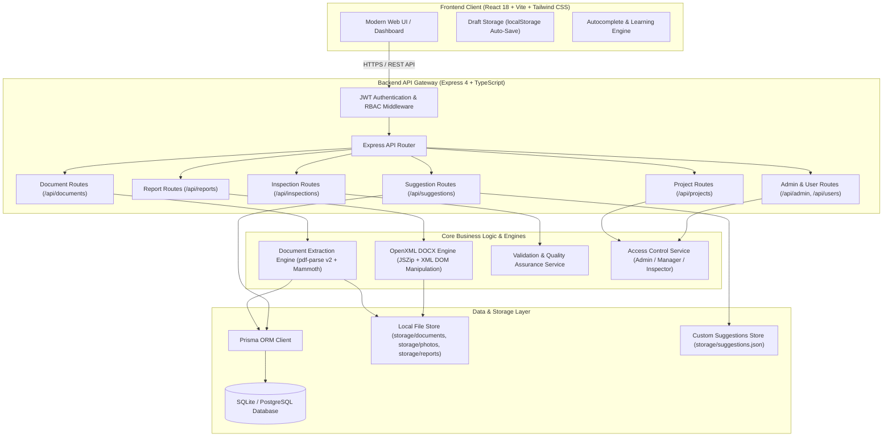
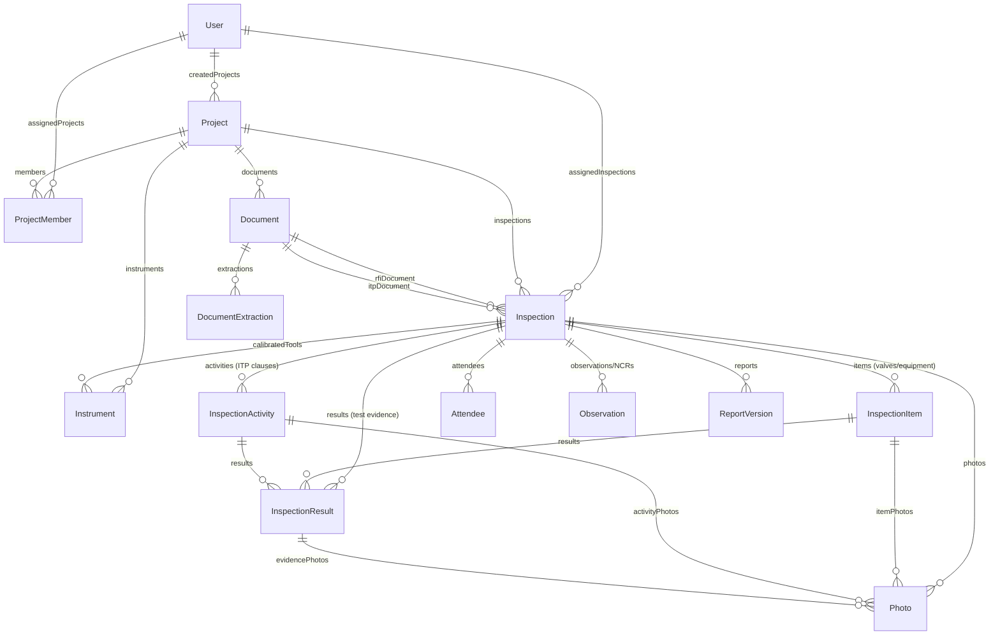
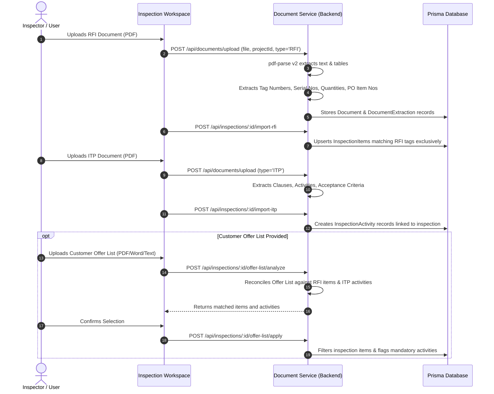
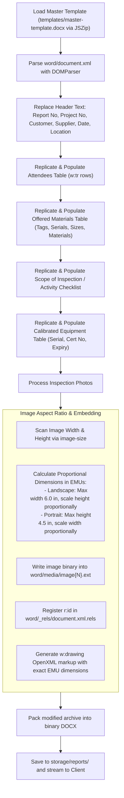

# INSPECTAI — Architecture & Technical Specification Document

> **System Version:** 2.0.0  
> **Status:** Active / Production-Ready  
> **Target Audience:** Software Engineers, System Architects, QA Engineers, DevOps, Security Reviewers  
> **Maintenance Rule:** *This document MUST be updated whenever database models, API contracts, document extraction logic, or report generation pipelines are modified.*

---

## 1. System Overview & Mission

**INSPECTAI** is an industrial-grade inspection report automation and verification platform designed specifically for Third-Party Inspection Agencies (TPIA) and engineering contractors operating in mission-critical energy, EPC, and manufacturing sectors (e.g., ADNOC, CPECC, KSB MIL Controls, Saudi Aramco).

The system replaces manual, error-prone report generation by automating:
1. **Intelligent Document Ingestion**: Ingesting and extracting structured data from vendor **Request for Inspection (RFI)**, **Inspection and Test Plans (ITP)**, and **Customer Offer Lists**.
2. **Deterministic Data Reconciliation**: Aligning offered materials against inspection activities, ensuring only applicable tags and clauses are tested.
3. **Field Data Capture**: Tracking test pressures, holding times, test mediums, calibration instruments, attendees, and photos with zero aspect-ratio distortion.
4. **Dynamic OpenXML DOCX Report Generation**: Generating pixel-perfect Microsoft Word (`.docx`) inspection reports matching official customer templates with zero XML corruption and 100% Word compatibility.
5. **Hierarchical Multi-Tenant Access Control**: Role-Based Access Control (RBAC) supporting Admins, Managers, and Field Inspectors.

---

## 2. High-Level Architecture Diagram



---

## 3. Technology Stack & Versions

| Layer | Technology | Version | Purpose |
|---|---|---|---|
| **Frontend Framework** | React | `^18.3.1` | Component-based interactive single-page application (SPA) |
| **Frontend Language** | TypeScript | `~5.5.3` | Type safety and strict interface enforcement |
| **Build Tool** | Vite | `^8.3.0` | Ultra-fast HMR and optimized production bundling |
| **Styling** | Tailwind CSS | `^3.4.17` | Utility-first responsive design system |
| **Icons** | Lucide React | `^0.468.0` | Modern, clean vector iconography |
| **HTTP Client** | Axios | `^1.7.9` | Request/response interceptors with JWT token injection |
| **Backend Runtime** | Node.js | `>=18.x` | High-throughput asynchronous JavaScript runtime |
| **Backend Framework** | Express | `^4.21.2` | RESTful API server with modular routing |
| **Backend Language** | TypeScript | `^5.6.3` | Strong typing across services, controllers, and schemas |
| **Database ORM** | Prisma ORM | `^5.22.0` | Declarative schema definitions and migrations |
| **Database Engine** | SQLite (dev) / PostgreSQL (prod) | Current | Relational data persistence with foreign key constraints |
| **PDF Extraction** | `pdf-parse` | `^2.4.5` (Class API) | Multi-page text extraction and regex table layout parsing |
| **DOCX Processing** | `jszip` | `^3.10.1` | Native OpenXML archive extraction, parsing, and packing |
| **Image Analysis** | `image-size` | `^1.2.0` | Reading image dimensions for aspect-ratio preservation |
| **Security & Auth** | `jsonwebtoken`, `bcryptjs` | Current | Stateless JWT authentication with salted password hashing |

---

## 4. Repository Structure

```
d:\Inspection report\
├── client/                     # Frontend Single Page Application
│   ├── src/
│   │   ├── api.ts              # Centralized Axios API client & typed functions
│   │   ├── App.tsx             # Main router, pages, tabs, and workspace UI
│   │   ├── AutocompleteInput.tsx # Searchable combobox with auto-learning suggestions
│   │   ├── draftStorage.ts     # Client-side form draft persistence & recovery
│   │   ├── DeploymentGuardian.tsx # Health checks & connectivity monitor
│   │   ├── AdminPage.tsx       # User & role management dashboard
│   │   └── main.tsx            # React application entry point
│   ├── package.json
│   └── vite.config.ts
├── server/                     # Backend API & Processing Server
│   ├── prisma/
│   │   ├── schema.prisma       # 15 relational models (Users, Projects, Inspections, etc.)
│   │   └── dev.db              # SQLite development database file
│   ├── src/
│   │   ├── index.ts            # Server entry point, CORS, routes, static asset serving
│   │   ├── middleware/
│   │   │   └── auth.ts         # JWT token decoding & user role attachment
│   │   ├── routes/
│   │   │   ├── authRoutes.ts   # Login, registration, token verification
│   │   │   ├── projectRoutes.ts# Project CRUD & team member assignment
│   │   │   ├── documentRoutes.ts# Multi-part upload, extraction triggers
│   │   │   ├── inspectionRoutes.ts# Inspection workspace, items, activities, offer list
│   │   │   ├── suggestionRoutes.ts# Auto dropdown suggestion learning & querying
│   │   │   ├── resultRoutes.ts # Measurement, test pressure, holding time CRUD
│   │   │   ├── photoRoutes.ts  # Photo upload and item/activity linking
│   │   │   ├── reportRoutes.ts # DOCX report generation & download
│   │   │   ├── adminRoutes.ts  # Admin operations & system health
│   │   │   └── userRoutes.ts   # User profile and manager-subordinate management
│   │   ├── services/
│   │   │   ├── documentService.ts # PDF parser, RFI/ITP table extractors
│   │   │   ├── reportService.ts   # OpenXML DOCX template engine & image injector
│   │   │   ├── validationService.ts# Inspection completeness & calibration checks
│   │   │   └── accessControlService.ts# Role-based filtering (Admin / Manager / Inspector)
│   ├── package.json
│   └── tsconfig.json
├── storage/                    # Persistent Server Storage (excluded from git)
│   ├── documents/              # Uploaded RFIs, ITPs, Offer Letters (.pdf, .docx)
│   ├── photos/                 # Uploaded inspection photos (.jpg, .png)
│   ├── reports/                # Generated output reports (.docx)
│   └── suggestions.json        # Persistent custom suggestion entries
├── templates/                  # Master Word Templates
│   ├── master-template.docx    # Base OpenXML inspection report format
│   └── ...                     # Client-specific variants (KSB, ADNOC, etc.)
├── ARCHITECTURE.md             # This comprehensive architecture document
├── README.md                   # Quick start & developer overview
├── Dockerfile                  # Multi-stage production container build
└── docker-compose.yml          # Container orchestration configuration
```

---

## 5. Core Data Models & Relationships

The database schema is defined in [`server/prisma/schema.prisma`](file:///d:/Inspection%20report/server/prisma/schema.prisma) and manages 15 relational models:



### Key Models Defined
1. **`User`**: System account with role (`ADMIN`, `MANAGER`, `INSPECTOR`) and optional `managerId` for organizational hierarchies.
2. **`Project`**: High-level contract container holding `projectNumber`, `customerName`, `supplierName`, `supplierAddress`, and `poNumber`.
3. **`ProjectMember`**: Join model explicitly assigning users to projects.
4. **`Document` & `DocumentExtraction`**: Storage metadata and raw/parsed JSON data extracted from uploaded files.
5. **`Inspection`**: Primary work session. Tracks report number, dates, location, ITP revision, material description, narrative summary, and linked RFI/ITP/Offer documents.
6. **`InspectionItem`**: Distinct hardware components (e.g., Tag `14-01-FCV-1601-01A`, Serial `25009567`, Size `24"`, Rating `#600 RF`, Material `Gr WCC`).
7. **`InspectionActivity`**: Clauses from the ITP (e.g., Clause `7.1 Body mount Leakage test`, Acceptance Criteria, Intervention levels `H/W/R`).
8. **`InspectionResult`**: Quantitative test measurements (Test Pressure, Holding Time, Test Medium, Leakage, Open/Close Stroke times).
9. **`Instrument` & `CalibrationCert`**: Measuring tools (Pressure Gauge, Vernier Caliper, Stopwatch) with certificate numbers and expiration dates.
10. **`Attendee`**: Participants in inspection meeting (Name, Company, Represented Org, Title).
11. **`Photo`**: High-resolution photographic evidence categorized by item, activity, or result.

---

## 6. End-to-End Processing Workflows

### 6.1 Document Ingestion & Reconciliation Pipeline



### 6.2 Dynamic Auto Dropdown & Learning Engine

To accelerate data entry and prevent typos in Customer, Supplier, and Location fields:
1. **Dynamic Harvest**: When the user opens a form, `GET /api/suggestions` aggregates unique values from:
   - Existing `Project` records (`customerName`, `supplierName`, `supplierAddress`).
   - Existing `Inspection` records (`location`).
   - The file store `storage/suggestions.json`.
2. **Auto-Learning**: Whenever a novel value is entered or saved:
   - The client registers it immediately in `localStorage` and triggers a custom window event (`inspectai-suggestion-added`).
   - The backend `POST /api/suggestions` writes it to `storage/suggestions.json`.
   - All open tabs and components update their dropdowns in real time without a page refresh.

### 6.3 OpenXML DOCX Report Generation Engine

Generating industrial reports in Word requires strict compliance with Microsoft OpenXML schemas (`ISO/IEC 29500`):



#### Key OpenXML Safety Rules Enforced:
- **XML Sanitization**: All user strings pass through an XML sanitizer replacing `&`, `<`, `>`, `"`, and `'` with standard XML entities.
- **Row Replication**: Table rows (`<w:tr>`) are cloned from template sample rows to preserve styling, cell borders, and font definitions.
- **Aspect Ratio Preservation**: Images are NEVER stretched. Using standard English Metric Units ($1\text{ inch} = 914400\text{ EMUs}$), landscape photos are fitted to page width ($5486400\text{ EMUs}$) and portrait photos are fitted to maximum height without distortion.

---

## 7. Role-Based Access Control (RBAC) Hierarchy

The system enforces a tree-structured access control model managed by [`accessControlService.ts`](file:///d:/Inspection%20report/server/src/services/accessControlService.ts):

| Role | Permissions | Visibility Scope |
|---|---|---|
| **`ADMIN`** | Full CRUD on all projects, inspections, documents, users, and system settings. Can assign any user to any project. | Global across the entire platform. |
| **`MANAGER`** | Can create new Field Staff (`INSPECTOR`), create projects, and assign staff. Can view all inspections for projects assigned to them or their team. | Projects and inspections where the manager or their subordinates are members. |
| **`INSPECTOR`** | Can view assigned projects, conduct inspections, upload photos, fill checklists, and generate reports. | Strictly limited to assigned projects and inspections. |

---

## 8. API Endpoints Reference

### Authentication & Users
- `POST /api/auth/login` — Authenticate email/password; returns JWT and user profile.
- `POST /api/auth/register` — Register new user account.
- `GET /api/auth/me` — Return current authenticated session.
- `GET /api/users` — List system users (filtered by role/hierarchy).
- `POST /api/users` — Create new staff member (Admin/Manager only).

### Projects & Team Assignment
- `GET /api/projects` — List accessible projects for current user.
- `POST /api/projects` — Create new project (with Customer, Supplier, Location combobox support).
- `GET /api/projects/:id` — Get project details, assigned members, and associated documents.
- `PUT /api/projects/:id` — Update project metadata.
- `DELETE /api/projects/:id` — Safely delete project and cascade cleanup.
- `POST /api/projects/:id/members` — Assign staff member to project.
- `DELETE /api/projects/:id/members/:userId` — Remove staff member from project.

### Document Management
- `POST /api/documents/upload` — Upload multipart file (RFI, ITP, Offer List, Certificate).
- `GET /api/documents` — Query documents by `projectId`.
- `GET /api/documents/:id` — Get document metadata.
- `POST /api/documents/:id/process` — Trigger text extraction and parser.
- `DELETE /api/documents/:id` — Remove document.

### Inspection Workspace & Offer List
- `GET /api/inspections` — Query inspections by project or inspector.
- `POST /api/inspections` — Create new inspection.
- `GET /api/inspections/:id` — Return master inspection object with all items, activities, results, attendees, and photos.
- `PUT /api/inspections/:id` — Update inspection status, location, dates, narrative summary.
- `DELETE /api/inspections/:id` — Delete inspection.
- `POST /api/inspections/:id/import-rfi` — Populate items from linked RFI document.
- `POST /api/inspections/:id/import-itp` — Populate activities from linked ITP document.
- `POST /api/inspections/:id/recall-rfi` — Reset items strictly to RFI baseline.
- `POST /api/inspections/:id/offer-list/analyze` — Reconcile offer list against RFI items and ITP activities.
- `POST /api/inspections/:id/offer-list/apply` — Apply reconciled item and activity selection.

### Suggestions & Autocomplete
- `GET /api/suggestions` — Fetch dynamic lists for `customers`, `suppliers`, and `locations`.
- `POST /api/suggestions` — Register a newly entered suggestion value.

### Reports & Output
- `POST /api/reports/generate/:inspectionId` — Compile and generate OpenXML DOCX report.
- `GET /api/reports/download/:id` — Download generated DOCX file.
- `GET /api/inspections/:id/validate` — Run quality validation checks.

---

## 9. Client-Side Resiliency & Draft Storage

To protect field inspectors in remote facilities with unstable network connectivity:
- [`draftStorage.ts`](file:///d:/Inspection%20report/client/src/draftStorage.ts) automatically synchronizes in-progress form entries into browser `localStorage`.
- Draft keys are scoped by form context:
  - `new_project`
  - `new_inspection`
  - `inspection_{id}_results`
- If an inspector accidentally closes their browser or loses connectivity, a notification banner offers instant 1-click draft restoration.
- Once a form is submitted to the API, drafts are cleared cleanly to prevent stale data.

---

## 10. Developer Setup & Operations

### Local Development Setup
```bash
# 1. Clone repository
git clone https://github.com/Adarsh5816/inspectai.git
cd inspectai

# 2. Setup and run Backend Server
cd server
npm install
npx prisma db push
npx tsx src/db/seed.ts    # Creates demo admin user (admin@inspectai.com / admin123)
npm run dev              # Runs on http://localhost:4000

# 3. Setup and run Frontend Client (in a separate terminal)
cd ../client
npm install
npm run dev              # Runs on http://localhost:3000
```

### Production Build & Verification
```bash
# Verify Client compilation
cd client
npm run build            # Builds production assets to client/dist

# Verify Server compilation
cd ../server
npm run build            # Compiles TypeScript into server/dist
```

### Docker Deployment
```bash
# Multi-stage production container build
docker compose up -d --build
```
Access the application at `http://localhost:4000`.

---

## 11. Maintenance & Review Guidelines

Whenever contributing changes to this repository:
1. **Model Changes**: Any modification to `server/prisma/schema.prisma` requires running `npx prisma db push` and updating the ERD diagram and model lists in this document.
2. **OpenXML Verification**: Any modification to `reportService.ts` must be tested by generating a full DOCX report and opening it in native Microsoft Word to verify that no repair prompts occur.
3. **Submodule Protection**: The `WhatsappAPI` directory contains a distinct submodule; do NOT include it in main commits.
4. **Living Documentation**: Update this document (`ARCHITECTURE.md`) and [`README.md`](file:///d:/Inspection%20report/README.md) as part of your pull request.
