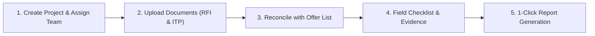

# INSPECTAI — AI-Powered Inspection Report Automation Platform

> **Comprehensive Developer Architecture**: For an in-depth technical specification, database ERD, API reference, OpenXML engine mechanics, and security model, please see [**`ARCHITECTURE.md`**](./ARCHITECTURE.md).

---

## 🌟 What is INSPECTAI?

**INSPECTAI** is an intelligent industrial inspection management system created for Third-Party Inspection Agencies (TPIA) and engineering contractors (working with ADNOC, KSB MIL Controls, CPECC, etc.).

It solves the major pain point of industrial quality control: **manual, repetitive, and error-prone inspection report preparation**. 

Instead of copying and pasting valve tags, pressure test readings, calibration dates, and photos into Word documents by hand, INSPECTAI:
1. **Reads engineering PDFs** (Vendor RFIs, ITPs, and Offer Letters) and extracts the data automatically.
2. **Reconciles offered equipment** with required inspection activities so inspectors test only what is required.
3. **Provides a field-ready checklist** where inspectors record test pressures, holding times, and capture high-resolution photos without distortion.
4. **Instantly generates official, 100% compliant Microsoft Word (`.docx`) reports** based on master templates, with zero XML corruption.

---

## 🚀 How the Whole Application Works (In 5 Simple Steps)



### 1. Project Creation & Staff Assignment
- Create a project with project number, customer name, supplier name, location, and purchase order (PO) number.
- **Auto Dropdown**: The application automatically remembers previously entered Customers, Suppliers, and Locations, providing instant autocomplete suggestions that save new entries automatically.
- **Tree-Structured Access**: Managers can create staff members and assign specific field inspectors to projects so each inspector only sees the work assigned to them.

### 2. Document Ingestion (RFI & ITP)
- In the project workspace, upload the **Request for Inspection (RFI)** and **Inspection and Test Plan (ITP)** documents (PDF/Word).
- The built-in extraction engine extracts valve/equipment tag numbers, serial numbers, quantities, ITP clauses, acceptance criteria, and intervention points (`H/W/R`).

### 3. Customer Offer List Reconciliation
- Customers often offer only a subset of items or request specific activities for a given inspection visit.
- Upload or paste the **Customer Offer List**. The engine validates the offer against the RFI and ITP, auto-selecting only the matched equipment tags and relevant activities.

### 4. Field Inspection Workspace
During the physical inspection, the inspector uses the web interface to:
- Fill out the **Checklist**: Record test pressure (bar/psi), test medium (Water/Air/Nitrogen), holding time (minutes), open/close stroke times, and ambient conditions.
- Attach **Photos**: Upload photos of valves, nameplates, testing gauges, or hydrotests. Photos maintain their native aspect ratio (landscape or portrait) without stretching or squishing.
- Select **Calibrated Instruments**: 1-click loading of standard calibrated vendor tools (Pressure Gauges, Calipers, Stopwatches) with active calibration expiry tracking.
- Record **Meeting Attendees**: Log representatives from the client, TPIA, and vendor.

### 5. Automated DOCX Report Generation
- With one click, INSPECTAI compiles all project metadata, scope of inspection, valve tables, test readings, calibration logs, attendees, and photos into a finalized `.docx` document matching the client's official format.
- Output documents open cleanly in Microsoft Word without any recovery warnings or XML formatting issues.

---

## 🛠️ Technology Stack

| Component | Technology | Description |
|---|---|---|
| **Frontend** | React 18, TypeScript, Vite, Tailwind CSS | Fast, responsive web application with draft auto-saving |
| **Backend** | Node.js, Express, TypeScript | RESTful API server with modular routing and RBAC |
| **Database** | Prisma ORM, SQLite / PostgreSQL | Robust relational data storage for 15 interconnected models |
| **Doc Extraction** | `pdf-parse` (v2), Mammoth | Automated text & table extraction from engineering documents |
| **Report Engine** | `jszip`, OpenXML DOM parser | Direct Word document manipulation & photo injection |
| **Photo Engine** | `image-size`, OpenXML DrawingML | Aspect-ratio preserving photo layout in EMUs |
| **Authentication** | JWT, bcrypt | Secure stateless session authentication |

---

## 🏃 Quick Start (Local Development)

### Prerequisites
- Node.js `>=18.x`
- npm `>=9.x`

### 1. Start the Backend API Server
```bash
cd server
npm install
npx prisma db push
npx tsx src/db/seed.ts     # Populates default admin (admin@inspectai.com / admin123)
npm run dev               # Starts API on http://localhost:4000
```

### 2. Start the Frontend Application
Open a new terminal:
```bash
cd client
npm install
npm run dev               # Starts UI on http://localhost:3000
```
Open your browser and navigate to `http://localhost:3000`.

---

## 🐳 Docker Deployment

To build and run the entire application in a production container:

```bash
docker compose up -d --build
```

The application will be live at `http://localhost:4000`.

---

## 📖 Complete Documentation & Review

For in-depth architectural and developer documentation, consult:
- [**`ARCHITECTURE.md`**](./ARCHITECTURE.md) — Comprehensive architectural specification, ERD diagram, pipeline flowcharts, OpenXML rules, and API endpoints.

---

## 🔄 Documentation Maintenance Policy

**Rule for all contributors & developers:**
> Any change to data models (`schema.prisma`), API endpoints (`server/src/routes`), document extraction algorithms (`documentService.ts`), or report generation templates (`reportService.ts`) **must be documented immediately in `ARCHITECTURE.md` and `README.md`**. Keep diagrams and technical descriptions accurate and in sync with the codebase.
